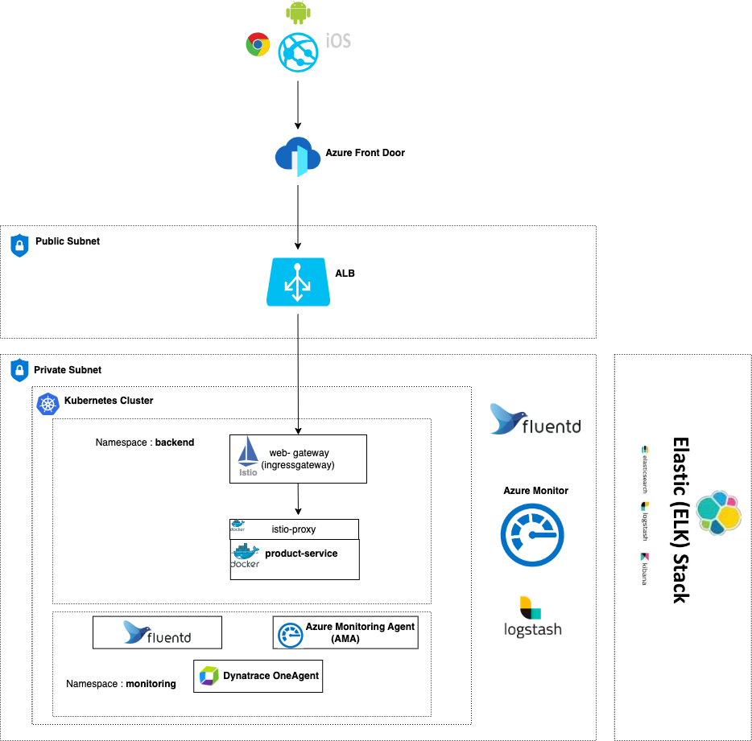

# Product API

Microservice to manage products, offering CRUD operations such as Create Product, Get All Products, Get Product by ID, Update Product, and Delete Product.

## Technology Requirements

- **[Java 21](https://www.oracle.com/java/)**: Latest LTS version of Java.
- **[Maven](https://maven.apache.org/)**: Build automation tool for Java projects.
- **[Spring Boot](https://spring.io/projects/spring-boot/)**: Framework for creating stand-alone, production-grade Spring-based applications.
- **[H2 Database](https://www.h2database.com/html/main.html)**: In-memory database for testing.
- **[JUnit](https://junit.org/)**: Testing framework for Java.
- **[Mockito](https://site.mockito.org/)**: Framework for creating mock objects in unit tests.
- **[Docker](https://www.docker.com/)**: Platform to build, share, and run applications in containers.
- **[OpenAPI 3.0.3](https://spec.openapis.org/oas/v3.0.3)**: Specification for documenting RESTful APIs.
- **[JaCoCo](https://www.eclemma.org/jacoco/)**: Java code coverage library.

## Application Architecture



## Running the Application

### Using Docker

1. **Install Colima and Docker**:
   ```bash
   brew install docker
   brew install colima


2. **start Colima**:
    ```bash
    colima start --kubernetes --network-address --cpu 4 --memory 16 --mount $HOME:w
    
    ```
3. **Build Docker Image**:
    ```bash
     docker build --rm -f "Dockerfile" -t product-service:latest "."
    ```
4. Run Docker Containe
    ```bash
    docker container run  -p 8080:8080 -d  --rm --name product-service product-service:latest
    ```
5. Test the Apllication using host http://localhost:8080
## Using Kubernetes
1. Push Docker Image (if not done locally):
    ```bash
     docker push <your-docker-registry>/product-service:latest
    ```

2. Deploy the image to kubernetics pod using apply command 
    ```bash
       cd kubernetes
       kubectl apply -f secrets.yaml
       kubectl apply -f deployment.yaml
       kubectl port-forward svc/product-service 8080:8080 -n backend
     ```

3. Check Pod Status:
    ```bash
       kubectl get pods -n backend
    ```
4. Test the Apllication using host http://product.example.com
## Using Helm in Kubernetes

1. Build Docker Image:
    ```bash
     docker build --rm -f "Dockerfile" -t product-service:latest "."
    ```
2. Deploy Using Helm:
    ```bash
       helm install product-service ./helm/product-service -n backend
       helm upgrade product-service ./helm/product-service -n backend
     ```
3. Check Pod Status:
    ```bash
       kubectl get pods -n backend
    ```
4. Test the Apllication using host http://product.example.com
## Running on Azure Cloud

1. Set Up Build Pipeline:

   - Use Maven template to define stages: test, package, build image, push image to Docker registry.
2. Set Up Release Pipeline:

    - Deploy the application using Helm upgrade command:
      ```bash
       helm upgrade product-service ./helm/product-service -n backend
      ```
3. Check Pod Status:
    ```bash
       kubectl get pods -n backend
      ```
4. Test the Apllication using host http://product.example.com
## Running the application with IDE

1. Clone or Download the Repository:

   - Download the zip or clone the Git repository.
2. Import Project in IntelliJ:

   - File -> Import -> Existing Maven Project -> Navigate to the project folder.
3. Run mvn clean install(This step is mandatory for generating DTOs from openapi spec)
    ```bash
        mvn clean install -DskipTests=true 
      ```
4. Run the Application:

   - Find the class with @SpringBootApplication (e.g., ProductServiceApplication).
   Right-click and choose "Run".

5. Test the Apllication using host http://localhost:8080.

     
## Health Check
- path : /product-service/health
- port : 8080


## Data Contract

- OpenAPI Specification: Located at product-service-open-api.yaml.
- Edit and View: Use Swagger Editor by pasting the YAML contents


## API collection
- Postman Collection: Available in the ./postman-collection directory


## Test Coverage
- Coverage: 100% for all classes except those under model and dto packages.
- Tool: JaCoCo for generating coverage reports.

## Technology Rationale
- Java 21: Latest LTS version ensures long-term support and access to modern features.
- Spring Boot: Simplifies microservice development with extensive tooling.
- H2 Database: Suitable for lightweight, in-memory testing.
- JUnit: Industry-standard framework for unit testing.
- Docker: Facilitates consistent application deployment across environments.
- OpenAPI: Standardized API documentation for easier integration.
- JaCoCo: Ensures code quality through detailed coverage reports.
